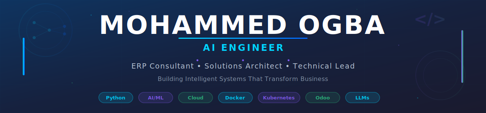

<div align="center" style="line-height: 0;">
  
  
</div>

<h1 align="center">Hi there, its my Bio 👨‍💻</h1>

<p align="center">
  <strong>AI Engineer | ERP Consultant | Software & Solutions Architect</strong>
</p>

<p align="center">
  <a href="https://linkedin.com/in/mohamed-awad-079485115">
    
  </a>
  <a href="mailto:ogba.awed@gmail.com">
    
  </a>
  <a href="https://github.com/ogbaamoha">
    
  </a>
</p>

<p align="center">
  <em>"Transforming business challenges into intelligent solutions through AI and strategic software architecture."</em>
</p>

---

## 🧠 About Me

I'm a passionate **AI Engineer** and **ERP Consultant** with a proven track record of bridging the gap between complex business requirements and cutting-edge technology solutions. My expertise lies in designing and implementing intelligent systems that drive operational efficiency and business growth.

### What I Do:

🔹 **AI & Machine Learning**: Building intelligent pipelines, RAG systems, and LLM-powered applications
🔹 **ERP Solutions**: Customizing and optimizing enterprise systems for business excellence
🔹 **Software Architecture**: Designing scalable, maintainable, and high-performance systems
🔹 **Technical Leadership**: Mentoring teams, managing projects, and driving technical innovation

### My Approach:

I believe in **pragmatic innovation** — leveraging the latest technologies while maintaining a strong focus on business value, scalability, and maintainability. Every solution I architect is designed with real-world impact in mind.

---

## 🛠️ Tech Stack & Expertise

<details open>
<summary><b>Languages & Frameworks</b></summary>
<br>


</details>

<details open>
<summary><b>AI & Machine Learning</b></summary>
<br>


</details>

<details open>
<summary><b>Databases & Storage</b></summary>
<br>


</details>

<details open>
<summary><b>DevOps & Cloud</b></summary>
<br>


</details>

<details open>
<summary><b>Tools & Practices</b></summary>
<br>


</details>

---

## 💼 Professional Experience

### Current Focus
```
🎯 AI Engineer & ERP Consultant
   └─ Designing and integrating intelligent business systems
   └─ Building RAG-based knowledge retrieval systems
   └─ Implementing LLM-powered automation solutions
```

### Key Roles & Expertise

| Role | Responsibilities |
|------|-----------------|
| **Solutions Architect** | System design, architectural decisions, technology stack selection, scalability planning |
| **Technical Lead** | Team mentorship, code review, technical roadmap alignment, best practices enforcement |
| **AI Engineer** | LLM integration, ML pipelines, data processing, intelligent automation |
| **ERP Specialist** | Odoo customization, business process optimization, module development, system integration |
| **Backend Developer** | API design, microservices, database optimization, cloud deployments |

---

## 🏆 Certifications & Achievements

<table>
<tr>
<td width="50%">

### Cloud & Infrastructure
- ☁️ **Azure Fundamentals (AZ-900)**
- 🐳 **Docker Mastery**
- 🏗️ **Terraform Certified Associate**
- 🎖️ **Red Hat Certified Engineer (RHCE)**

</td>
<td width="50%">

### Current Focus Areas
- 🤖 **LLM Integration & Fine-tuning**
- 📚 **RAG Systems & Vector Databases**
- 🔧 **AI-Driven Business Automation**
- 🚀 **Microservices Architecture**

</td>
</tr>
</table>  

---

## 📊 GitHub Analytics

<p align="center">
  
  
</p>

<p align="center">
  
</p>

<p align="center">
  
</p>

---

## 🌐 Let's Connect

<p align="center">
  <a href="https://linkedin.com/in/mohamed-awad-079485115">
    
  </a>
  <a href="mailto:ogba.awed@gmail.com">
    
  </a>
  <a href="https://github.com/ogbaamoha">
    
  </a>
</p>

<p align="center">
  
</p>

---

## 💭 Philosophy

<p align="center">
  <em>"Building intelligent systems that don't just work — they transform."</em>
</p>

<p align="center">
  <sub>Every line of code is an opportunity to create value. Every architecture decision shapes the future.</sub>
</p>

---

<p align="center">
  
</p>
